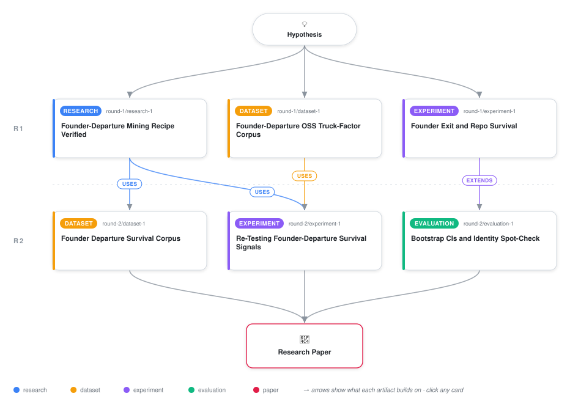

# Scaling the Corpus, Auditing the Power, and Reconciling the Sign: What Happens When a Founder-Diffusion Survival Test Is Finally Interrogated Rather Than Just Run

<div align="center">

<a href="https://cdn.jsdelivr.net/gh/ai-inventor-papers/ai-invention-24ffbe-pre-departure-bus-factor-diffusion@fork/run_r-byUQiUWdrF/workflow.svg">
<picture>
  <source media="(prefers-color-scheme: dark)" srcset="workflow-dark.svg">
  
</picture>
</a>

<sub>🖱️ <b><a href="https://cdn.jsdelivr.net/gh/ai-inventor-papers/ai-invention-24ffbe-pre-departure-bus-factor-diffusion@fork/run_r-byUQiUWdrF/workflow.svg">Open the interactive diagram</a></b> — every card links to its artifact folder.</sub>

</div>

> **TL;DR** — Second follow-up iteration of a founder-departure/authority-diffusion survival study. Scaled the fame-independent sampling frame at the search stage (270->1,170 sampled, 69->254 processed repositories) with a fully disclosed per-cell filtering funnel, but discovered and disclosed a second pipeline-timing defect: the experiment stage (34-repo intermediate snapshot, n=19 strict / 22 relaxed founder-only events) and the evaluation stage (cached 16/20-event snapshot matching the prior iteration exactly) each ran before the scaled 254-repository corpus finished building, confirmed via file modification timestamps (dataset 21:06:46 UTC vs. experiment 19:54:52 vs. evaluation cache 19:48:53). Within those smaller snapshots, added three new results: a formal Monte Carlo power audit diagnosing quasi-complete separation at n=16 (power stays <=5.7% across effect sizes 0.25-10) and estimating ~120 events needed for 80% power at the observed founder-share effect (7.5x achieved n); a Firth bias-reduced penalized-logistic placebo regression whose 95% CI (-8.02, 6.72) cleanly includes zero, firmer than the prior iteration's unstable placebo fit; and a first same-corpus reconciliation test against Medappa et al.'s static write-access-ratio construct (n=13), whose coefficient (-3.27) replicates Medappa's diffusion-reduces-survival sign while the project's own timing-based founder-share measure keeps the opposite, protective sign in every regression across both iterations -- a dissociation not explained by collinearity (VIF~1.0) but too small-n (n=13) to be more than suggestive.

<details>
<summary>Full hypothesis</summary>

An open-source project's survival after its founder stops committing (a founder-only Truck Factor Developer Detachment, or TFDD, in Avelino et al.'s ESEM 2019 terminology) is hypothesized to depend less on the project's popularity or size at the moment of departure -- which Avelino et al. already show is statistically indistinguishable between survivors and non-survivors at the TFDD snapshot (d=0.13-0.26) -- and more on how diffused DOA-based commit/file authority already was among non-founder contributors in the 6-12 months BEFORE departure. Three iterations of testing establish the following, in order of evidential strength. (1) STRONGLY SUPPORTED: a fame-conditioned corpus structurally cannot test this hypothesis (it excludes non-surviving events by construction); a stratified, popularity-independent sampling frame across 6 languages and 3 star strata restores real outcome variance (14.3-45.0% survival across four different snapshots so far, bracketing Avelino et al.'s 40.6% reference), and this corpus-construction method is the load-bearing, reusable contribution -- now demonstrated a second time at greater scale (1,170 sampled -> 254 processed repositories, a fully disclosed per-cell funnel) though NOT yet run through the DOA/TFDD statistical pipeline. (2) NOT YET SUPPORTED OR REFUTED, AND NOW FORMALLY DIAGNOSED AS UNDERPOWERED RATHER THAN MERELY 'SMALL n': across four regression fits at n=13-20 spanning two iterations, the founder-share coefficient is negative (hypothesis-consistent direction) in every fit that converges, but none reaches significance and one fit outright fails with a singular information matrix. A Monte Carlo power audit run on this iteration's data shows this is not incidental: at n=16 with the current covariate set, no finite minimum detectable effect exists (power stays <=5.7% even at large simulated true effects, the signature of quasi-complete separation), and reaching 80% power at the observed effect size requires an estimated ~120 events for founder-share and ~60 for diffused-owner-count (roughly 3.75-7.5x the achieved n) -- these figures assume the n=16 point estimate approximates the true effect and should be read with that caveat, not as a firm target. The hypothesis's central causal claim remains open pending a corpus run at that scale; the 254-repository corpus already built is a plausible (though unverified, ~55-75-event-projected) step toward it. (3) PARTIALLY ADDRESSED, STILL OPEN: the working reconciliation with Medappa et al.'s opposite-signed finding (higher static write-access ratio reduces survival) was tested for the first time in the same corpus (n=13): a static whole-history write-access-ratio measure (medappa_ratio) replicates Medappa et al.'s sign, while this hypothesis's timing-specific founder-share measure retains the opposite, protective sign, and the two are not collinear (VIF~1.0) -- but the joint model with their interaction term, the model actually designed to test the reconciling claim, fails to converge at this n, so the dissociation rests on univariate fallback statistics only and must be treated as suggestive, not established, until it can be fit jointly (via a Firth-type penalized regression, mirroring the successful Firth rescue of the placebo test) at a larger n. (4) NEW METHODOLOGICAL FINDING THIS ITERATION: a second, distinct pipeline-timing race (beyond the one disclosed and only partially fixed after iteration 1) caused the experiment and evaluation stages to consume earlier, smaller intermediate snapshots of the corpus than the dataset-construction stage ultimately produced -- confirmed via file-modification timestamps, not inferred. This recurrence, on the identical class of bug, is itself informative: the fix scoped after the first disclosure (a completion signal) was not actually implemented before this run, so the general problem (any downstream stage can race ahead of a still-running upstream build stage) persists across whichever specific stage pair is involved. Implementing that completion-signal fix and re-running the full DOA/TFDD pipeline end-to-end on the already-built 254-repository corpus is now the single most concrete and highest-priority next step, since it would simultaneously test the core diffusion-predicts-survival claim at a larger, cleaner n and remove the recurring disclosure liability from the paper's central narrative.

</details>

[](https://cdn.jsdelivr.net/gh/ai-inventor-papers/ai-invention-24ffbe-pre-departure-bus-factor-diffusion@fork/run_r-byUQiUWdrF/paper.pdf) [](https://github.com/ai-inventor-papers/ai-invention-24ffbe-pre-departure-bus-factor-diffusion/tree/fork/run_r-byUQiUWdrF/paper_latex)

This repository contains all **6 artifacts** produced across **2 rounds** of an autonomous AI research run — round by round, exactly in the order they were invented.

## Round 1

| Artifact | Type | Demo | Source | Builds on |
|----------|------|------|--------|-----------|
| **[GitHub Founder-Departure Commit Corpus](https://github.com/ai-inventor-papers/ai-invention-24ffbe-pre-departure-bus-factor-diffusion/tree/fork/run_r-byUQiUWdrF/round-1/dataset-1)** | [](https://github.com/ai-inventor-papers/ai-invention-24ffbe-pre-departure-bus-factor-diffusion/tree/fork/run_r-byUQiUWdrF/round-1/dataset-1) | [](https://colab.research.google.com/github/ai-inventor-papers/ai-invention-24ffbe-pre-departure-bus-factor-diffusion/blob/fork/run_r-byUQiUWdrF/round-1/dataset-1/demo/data_code_demo.ipynb) | [](https://github.com/ai-inventor-papers/ai-invention-24ffbe-pre-departure-bus-factor-diffusion/tree/fork/run_r-byUQiUWdrF/round-1/dataset-1/src) | — |
| **[Does Founder Authority Diffusion Predict OSS Survival?](https://github.com/ai-inventor-papers/ai-invention-24ffbe-pre-departure-bus-factor-diffusion/tree/fork/run_r-byUQiUWdrF/round-1/experiment-1)** | [](https://github.com/ai-inventor-papers/ai-invention-24ffbe-pre-departure-bus-factor-diffusion/tree/fork/run_r-byUQiUWdrF/round-1/experiment-1) | [](https://colab.research.google.com/github/ai-inventor-papers/ai-invention-24ffbe-pre-departure-bus-factor-diffusion/blob/fork/run_r-byUQiUWdrF/round-1/experiment-1/demo/method_code_demo.ipynb) | [](https://github.com/ai-inventor-papers/ai-invention-24ffbe-pre-departure-bus-factor-diffusion/tree/fork/run_r-byUQiUWdrF/round-1/experiment-1/src) | — |
| **[Placebo-Window Falsification Audit for Founder Exit](https://github.com/ai-inventor-papers/ai-invention-24ffbe-pre-departure-bus-factor-diffusion/tree/fork/run_r-byUQiUWdrF/round-1/evaluation-1)** | [](https://github.com/ai-inventor-papers/ai-invention-24ffbe-pre-departure-bus-factor-diffusion/tree/fork/run_r-byUQiUWdrF/round-1/evaluation-1) | [](https://colab.research.google.com/github/ai-inventor-papers/ai-invention-24ffbe-pre-departure-bus-factor-diffusion/blob/fork/run_r-byUQiUWdrF/round-1/evaluation-1/demo/eval_code_demo.ipynb) | [](https://github.com/ai-inventor-papers/ai-invention-24ffbe-pre-departure-bus-factor-diffusion/tree/fork/run_r-byUQiUWdrF/round-1/evaluation-1/src) | — |

## Round 2

| Artifact | Type | Demo | Source | Builds on |
|----------|------|------|--------|-----------|
| **[Founder-Departure GitHub Commit Corpus](https://github.com/ai-inventor-papers/ai-invention-24ffbe-pre-departure-bus-factor-diffusion/tree/fork/run_r-byUQiUWdrF/round-2/dataset-1)** | [](https://github.com/ai-inventor-papers/ai-invention-24ffbe-pre-departure-bus-factor-diffusion/tree/fork/run_r-byUQiUWdrF/round-2/dataset-1) | [](https://colab.research.google.com/github/ai-inventor-papers/ai-invention-24ffbe-pre-departure-bus-factor-diffusion/blob/fork/run_r-byUQiUWdrF/round-2/dataset-1/demo/data_code_demo.ipynb) | [](https://github.com/ai-inventor-papers/ai-invention-24ffbe-pre-departure-bus-factor-diffusion/tree/fork/run_r-byUQiUWdrF/round-2/dataset-1/src) | — |
| **[Founder Diffusion Timing vs. Project Survival](https://github.com/ai-inventor-papers/ai-invention-24ffbe-pre-departure-bus-factor-diffusion/tree/fork/run_r-byUQiUWdrF/round-2/experiment-1)** | [](https://github.com/ai-inventor-papers/ai-invention-24ffbe-pre-departure-bus-factor-diffusion/tree/fork/run_r-byUQiUWdrF/round-2/experiment-1) | [](https://colab.research.google.com/github/ai-inventor-papers/ai-invention-24ffbe-pre-departure-bus-factor-diffusion/blob/fork/run_r-byUQiUWdrF/round-2/experiment-1/demo/method_code_demo.ipynb) | [](https://github.com/ai-inventor-papers/ai-invention-24ffbe-pre-departure-bus-factor-diffusion/tree/fork/run_r-byUQiUWdrF/round-2/experiment-1/src) | <sub><i>uses:</i><br/>[dataset‑1&nbsp;(R1)](https://github.com/ai-inventor-papers/ai-invention-24ffbe-pre-departure-bus-factor-diffusion/tree/fork/run_r-byUQiUWdrF/round-1/dataset-1)</sub> |
| **[Power Audit of Founder-Departure Survival Test](https://github.com/ai-inventor-papers/ai-invention-24ffbe-pre-departure-bus-factor-diffusion/tree/fork/run_r-byUQiUWdrF/round-2/evaluation-1)** | [](https://github.com/ai-inventor-papers/ai-invention-24ffbe-pre-departure-bus-factor-diffusion/tree/fork/run_r-byUQiUWdrF/round-2/evaluation-1) | — | [](https://github.com/ai-inventor-papers/ai-invention-24ffbe-pre-departure-bus-factor-diffusion/tree/fork/run_r-byUQiUWdrF/round-2/evaluation-1/src) | <sub><i>uses:</i><br/>[experiment‑1&nbsp;(R1)](https://github.com/ai-inventor-papers/ai-invention-24ffbe-pre-departure-bus-factor-diffusion/tree/fork/run_r-byUQiUWdrF/round-1/experiment-1)<br/><i>background:</i><br/>[dataset‑1&nbsp;(R1)](https://github.com/ai-inventor-papers/ai-invention-24ffbe-pre-departure-bus-factor-diffusion/tree/fork/run_r-byUQiUWdrF/round-1/dataset-1)</sub> |

## Repository Structure

Artifacts are grouped by the round of invention that produced them. Each
artifact has its own folder with source code and a self-contained demo:

```
.
├── round-1/                         # One folder per round of invention
│   ├── experiment-1/
│   │   ├── README.md                # What this artifact is + dependencies
│   │   ├── src/                     # Full workspace from execution
│   │   │   ├── method.py            # Main implementation
│   │   │   ├── method_out.json      # Full output data
│   │   │   └── ...                  # All execution artifacts
│   │   └── demo/                    # Self-contained demo
│   │       └── method_code_demo.ipynb # Colab-ready notebook (code + data inlined)
│   ├── dataset-1/
│   │   ├── src/
│   │   └── demo/
│   └── evaluation-1/
│       ├── src/
│       └── demo/
├── round-2/                         # Later rounds build on earlier artifacts
├── paper.pdf                        # Research paper
├── paper_latex/                     # LaTeX source files
├── chat/                            # Every prompt, response and tool call, per module
├── workflow.svg                     # Artifact dependency diagram (this page's header)
└── README.md
```

## Running Notebooks

### Option 1: Google Colab (Recommended)

Click the "Open in Colab" badges above to run notebooks directly in your browser.
No installation required!

### Option 2: Local Jupyter

```bash
# Clone the repo
git clone https://github.com/ai-inventor-papers/ai-invention-24ffbe-pre-departure-bus-factor-diffusion
cd ai-invention-24ffbe-pre-departure-bus-factor-diffusion

# Install dependencies
pip install jupyter

# Run any artifact's demo notebook
jupyter notebook <artifact_folder>/demo/
```

## Source Code

The original source files are in each artifact's `src/` folder.
These files may have external dependencies - use the demo notebooks for a self-contained experience.

---
*Generated by AI Inventor Pipeline - Automated Research Generation*
